# free-ebay

## If you want to check HONEST description which written by human not machine - check README_NOT_AI.md 

Event-driven microservices e-commerce platform built with .NET 8, gRPC, Kafka, and Python AI services. Implements distributed saga orchestration, event sourcing, CQRS, and hybrid semantic search.

---

## Architecture Overview

```mermaid
flowchart TD
    ProductAdmin["ProductAdmin (REST)<br/>HTTP :5000 · API key (X-Admin-Api-Key)"]
    Gateway["Gateway (REST)<br/>HTTP :8080 + Swagger"]

    subgraph Core["Core Services · gRPC :8080"]
        Auth["Auth"]
        User["User"]
        Product["Product"]
        Order["Order"]
        Payment["Payment"]
        Inventory["Inventory"]
        Search["Search"]
        Accounting["Accounting<br/>double-entry ledger"]
    end

    subgraph AISearch["AI Search"]
        AiSearch["AiSearchService<br/>gRPC :50051"]
        Ollama["Ollama :11434"]
        Qdrant["Qdrant :6333"]
        Elastic["Elasticsearch :9200"]
    end

    subgraph Partners["Partner Fakes · deterministic, dev / E2E"]
        Stripe["my-stripe :8090<br/>Stripe API fake · HMAC webhooks"]
        Dpd["my-dpd :8091<br/>DPD carrier fake · sync · HMAC webhooks"]
        Ppl["my-ppl :8092<br/>PPL carrier fake · 2-phase booking · plain-secret webhooks"]
    end

    AuthDB[("Postgres :5432")]
    UserDB[("Postgres :5433")]
    ProductDB[("Postgres :5435")]
    OrderDB[("Postgres :5437 / :5438")]
    PaymentDB[("Postgres :5436")]
    InventoryDB[("Postgres :5434")]
    AccountingDB[("Postgres :5441")]

    ProductAdmin -- "gRPC · direct, bypasses Gateway" --> Product

    Gateway -- gRPC --> Auth
    Gateway -- gRPC --> User
    Gateway -- gRPC --> Product
    Gateway -- gRPC --> Order
    Gateway -- gRPC --> Payment
    Gateway -- gRPC --> Inventory
    Gateway -- gRPC --> Search

    Auth --> AuthDB
    User --> UserDB
    Product --> ProductDB
    Order --> OrderDB
    Payment --> PaymentDB
    Inventory --> InventoryDB
    Accounting --> AccountingDB

    Payment -- "Kafka · payment.money-events" --> Accounting
    Order -- "gRPC · revenue reversal" --> Accounting

    Search -- gRPC --> AiSearch
    AiSearch --> Ollama
    AiSearch --> Qdrant
    AiSearch --> Elastic

    Payment -- HTTP --> Stripe
    Order -- HTTP --> Dpd
    Order -- HTTP --> Ppl
    Stripe -. webhook .-> Payment
    Dpd -. "webhook · return.delivered" .-> Gateway
    Ppl -. "webhook · return.delivered" .-> Gateway

    classDef entry fill:#dbeafe,stroke:#1d4ed8,color:#1e3a8a;
    classDef db fill:#fef3c7,stroke:#b45309,color:#7c2d12;
    classDef ai fill:#ede9fe,stroke:#6d28d9,color:#4c1d95;
    classDef partner fill:#dcfce7,stroke:#15803d,color:#14532d;
    class ProductAdmin,Gateway entry;
    class AuthDB,UserDB,ProductDB,OrderDB,PaymentDB,InventoryDB,AccountingDB db;
    class AiSearch,Ollama,Qdrant,Elastic ai;
    class Stripe,Dpd,Ppl partner;
```



All inter-service communication uses **gRPC**. The Gateway translates external HTTP/REST requests into gRPC calls. Kafka handles async event distribution between services.

Authentication has two boundaries (see [inter-service-auth.md](inter-service-auth.md)): **edge** requests carry an **RS256 JWT** that Auth signs with a private key and the Gateway/OpsConsole verify with the public key (a compromised verifier can check tokens but never mint them); **internal** gRPC hops rely on in-cluster network trust, plus a shared `x-internal-api-key` on the few privileged hops (OpsConsole→admin services, Auth→User bootstrap).

---

## Services

### Gateway (`/Gateway`)
REST API gateway. Single entry point for all clients. Translates HTTP requests to gRPC calls, enforces JWT authentication, and exposes Swagger/OpenAPI docs. Routes to Auth, User, Product, Order, Payment, Inventory, and Search services.

### Auth (`/Auth`)
JWT token lifecycle management: issuance, validation, refresh, revocation, password reset, email verification. Uses gRPC. Depends on User service for credential verification and Email for sending tokens.

- **DB**: Postgres (refresh tokens, email verification tokens, password reset tokens)

### User (`/User`)
User CRUD, role management, user restrictions. Core identity service with no external service dependencies.

- **DB**: Postgres (users, roles, restrictions)

### Product (`/Product`)
Product catalog management (CRUD). Publishes `ProductCreateEvent`, `ProductUpdatedEvent`, `ProductDeletedEvent` to Kafka for downstream consumers (Catalog, VectorIndexerWorker).

- **DB**: Postgres
- **Publishes**: Kafka topic `product.events`

### Order (`/Order`) — Most Complex Service
Order lifecycle via distributed **saga orchestration** with compensation, **event sourcing**, and **CQRS** (separate read/write databases).

**Key capabilities:**
- **CreateOrder saga** (8 steps): Validation → Inventory Reserve → Payment → Order Paid → Shipment → Approve → Complete → Email
- **ReturnOrder saga** (6 steps): Full compensation with reverse ordering
- **B2B orders**: Living quote negotiation workflow
- **Recurring orders**: Subscription scheduling
- **Compensation**: Step-level rollback + global cancellation + incident escalation for unrecoverable failures
- **Idempotency**: Enforced on every saga step
- **Watchdog**: Detects and recovers stuck sagas

**Background workers**: Outbox processor, saga orchestrator, compensation retry worker, read model synchronizer, recurring order scheduler, saga watchdog.

- **DB**: Postgres write (:5437) + Postgres read (:5438)
- **Dependencies**: Product (price validation), Payment (capture/refund), Inventory (stock reservation)
- **Locking**: Redis distributed locks for concurrent saga operations
- **Publishes**: Kafka topics `order.events`, `return.events`

### Payment (`/Payment`)
Payment processing via Stripe (mock provider available for dev). Handles dual-path finalization:
- **Synchronous path**: Stripe returns immediate status (pre-authorized card capture)
- **Async path**: Webhook push + reconciliation pull for pending/requires-action payments

Implements "effectively-once" semantics: at-least-once delivery + idempotency + DB constraints + outbox + reconciliation.

- **DB**: Postgres
- **Dependencies**: Stripe API, Order service (payment completion callbacks)
- **Endpoints**: gRPC (ProcessPayment, CapturePayment, RefundPayment) + REST webhook (`POST /webhook/stripe`)

### Inventory (`/Inventory`)
Real-time stock reservation lifecycle. Saga participant for order creation. Uses PostgreSQL **serializable isolation** with a transaction-retry engine that creates a fresh `DbContext` per retry after serialization conflicts (error 40001).

- **DB**: Postgres (serializable transactions)
- **gRPC**: ReserveInventory, ConfirmReservation, ReleaseReservation
- **Publishes**: Kafka topic `inventory.events`

### Catalog (`/Catalog`)
**CQRS read-model projector**. Consumes product events from Kafka and maintains an Elasticsearch index. No direct writes — purely event-driven projection.

- **Consumes**: Kafka topic `product.events`
- **Projects to**: Elasticsearch index `products`

### Search (`/Search`)
Search facade with dual-path: AI-enhanced semantic search via AiSearchService (gRPC), with automatic fallback to plain Elasticsearch on AI timeout.

- **Dependencies**: AiSearchService (gRPC :50051), Elasticsearch

### Email (`/Email`)
Async email delivery via Kafka consumer (no REST/gRPC endpoints). Implements idempotent message processing with a processed-message store. Includes dead-letter queue replay worker for failed messages.

- **Consumes**: Kafka topic `email.events`
- **DB**: Postgres (idempotency store)
- **SMTP**: MailHog in dev (:1025)

### Accounting (`/Accounting`)
Append-only **double-entry ledger** — the single source of monetary truth. Payment writes a money-event into the same transaction as the money mutation; Accounting consumes that stream and posts balanced entries.

**Key capabilities:**
- **Currency-native primitive ledger**: every transaction satisfies `Σdebits = Σcredits` per currency, enforced in the aggregate. Postings are append-only — corrections are new reversing transactions, never edits.
- **Two-layer idempotency**: `processed_events.event_id` (Kafka delivery) + unique `ledger_transactions.transaction_ref` (business key). The posting and the processed marker commit in one `SaveChangesAsync`.
- **Reconciliation worker**: checks per-currency balance, per-transaction balance, and per-order over-refund — the last catches the double-refund class that per-entity workers structurally cannot, because each refund is individually balanced.
- **FX reporting layer**: derived, rebuildable `ledger_reporting_entries` converted at the rate effective when the transaction occurred; rounding residue posts to `fx_gain_loss`.
- **Own incident reporter**: ledger drift pages a dedicated finance channel, never Order's.

- **DB**: Postgres (:5441)
- **Consumes**: Kafka topic `payment.money-events`
- **gRPC**: `AccountingService` (Order: ReverseRevenue, CancelReversal), `AdminAccountingService` (OpsConsole: trial balance, money trail, ledger health, adjusting entry)
- **Auth**: per-service `x-internal-api-key` — Order and OpsConsole hold different keys, so the console cannot reach the money-posting API

### Ops Console (`/OpsConsole`)
Internal-only admin dashboard for operators: saga monitoring, dead-letter triage, ledger views, and recovery actions (force-compensate, retry compensation, requeue, post adjusting entry) across Order, Payment, Inventory, and Accounting. Never routed through the Gateway. Two parts: a .NET Minimal API backend (gRPC client to the four admin services) and a Next.js frontend operators actually open.

- **DB**: none — stateless proxy
- **Dependencies**: Order (`AdminOpsService`), Payment (`AdminPaymentService`), Inventory (`AdminInventoryService`), Accounting (`AdminAccountingService`), Auth/Gateway (operator JWT + login)

---

## AI Services (`/AI`)

Three Python services providing hybrid semantic + keyword search:

### EmbeddingService
Thin REST wrapper around Ollama. Exposes `POST /embed` endpoint that generates 768-dimensional embeddings using `nomic-embed-text` model.

- **Port**: HTTP :8001
- **Depends on**: Ollama :11434

### VectorIndexerWorker
Kafka consumer that listens to `product.events`, generates embeddings via EmbeddingService, and upserts vectors + metadata into Qdrant. Handles create, update, and delete events.

- **Consumes**: Kafka topic `product.events`
- **Depends on**: EmbeddingService :8001, Qdrant :6333

### AiSearchService
Hybrid search engine exposed via gRPC (:50051). Pipeline:
1. **Query parsing**: Ollama LLM (`phi3:mini`) extracts semantic intent from user query
2. **Parallel search**: Embedding-based vector search (Qdrant) + BM25 keyword search (Elasticsearch)
3. **Merge**: Reciprocal Rank Fusion (RRF) combines results, then paginates

- **Port**: gRPC :50051, HTTP :8003 (health)
- **Depends on**: Ollama :11434, EmbeddingService :8001, Qdrant :6333, Elasticsearch :9200

### AI Data Flow
```
Product Service → Kafka (product.events)
  → VectorIndexerWorker → EmbeddingService → Ollama → 768-dim vectors → Qdrant

User search → Gateway → Search Service → AiSearchService (gRPC)
  ├─ Ollama (parse query with phi3:mini)
  ├─ EmbeddingService → Qdrant (vector search, top-50)
  └─ Elasticsearch (keyword search, top-50)
  → RRF merge → paginated results → Gateway → response
```

---

## Partner Simulators (Fakes)

Deterministic fakes of external providers, under `/partners`, used for local development and end-to-end saga tests. No real money or parcels move — every outcome is a pure function of the request (magic tokens in `orderId` / idempotency key, or a postal-code suffix), so saga branches are fully reproducible. The carrier fakes use SQLite (not in-memory) so a restart does not lose webhooks parked by the long-running return saga.

### my-stripe
In-memory fake of the Stripe payment API. Returns webhook-shaped JSON signed with the same HMAC scheme as real Stripe. Drives the Payment service's dual-path finalization (sync response + async webhook).

- **Used by**: Payment

### my-dpd
Go + SQLite fake of the **DPD** parcel carrier. Synchronous and reliable: immediate authoritative responses, idempotent cancel, HMAC-signed delivery webhooks (`Stripe-Signature`).

- **Port**: HTTP :8091
- **Used by**: Order (`DpdShippingAdapter`)

### my-ppl
Go + SQLite fake of the **PPL** parcel carrier. Two-phase async booking (submit → poll until accepted), cancellation refused once in transit (`409`), and progressive status webhooks authenticated with a plain `X-PPL-Webhook-Secret` header (no body signature).

- **Port**: HTTP :8092
- **Used by**: Order (`PplShippingAdapter`)

The Order return saga registers a delivery webhook; carriers call back into the **Gateway** (`POST /api/v1/webhooks/shipping/returns/delivered`), which branches on a `carrier` tag to verify DPD HMAC vs PPL plain-secret, then publishes `ReturnShipmentDeliveredEvent` to Kafka to resume the saga.

---

## Infrastructure

| Component       | Technology                        | Port(s)          | Purpose                                    |
|-----------------|-----------------------------------|------------------|--------------------------------------------|
| Message Broker  | Kafka (Confluent 7.6.0)           | 9092             | Async event distribution between services  |
| Coordination    | Zookeeper                         | 2181             | Kafka cluster coordination                 |
| Search Engine   | Elasticsearch 8.13.4              | 9200             | Full-text keyword search (BM25)            |
| Vector DB       | Qdrant v1.9.2                     | 6333             | Semantic vector search                     |
| LLM Runtime     | Ollama 0.3.6                      | 11434            | Embeddings (nomic-embed-text) + LLM (phi3:mini) |
| Cache / Locks   | Redis 7                           | 6379             | Distributed locks for saga orchestration   |
| Databases       | PostgreSQL                        | 5432–5440        | Per-service databases                      |
| Tracing         | Jaeger (all-in-one 1.56)          | 16686 (UI), 4317 | OpenTelemetry distributed tracing          |
| Email (dev)     | MailHog                           | 1025 (SMTP), 8025 (UI) | Local email trap                     |

---

## Key Architectural Patterns

| Pattern | Where Used | Purpose |
|---------|-----------|---------|
| **Event Sourcing** | Order | Events as source of truth; snapshots for read performance; delta replay; corrupt snapshot fallback |
| **Saga Orchestration** | Order | Distributed long-running transactions with step-level retry, compensation, and incident escalation |
| **CQRS** | Order, Catalog, Search | Separate read/write models optimized for their access patterns |
| **Transactional Outbox** | Order, Email | Reliable Kafka publishing even during broker outages |
| **Inbox Pattern** | Order (read models) | Idempotent event consumption for eventual consistency |
| **Serializable Isolation** | Inventory | Database-level transactional guarantees for stock reservations |
| **Dual-Path Finalization** | Payment | Synchronous capture + async webhook/reconciliation fallback |
| **Double-Entry Ledger** | Accounting | Append-only money truth; `Σdebits = Σcredits` per currency; corrections are reversing entries, never edits |
| **Aggregate Reconciliation** | Accounting | Compares totals rather than converging single entities — catches over-refunds that are individually well-formed |
| **RRF Hybrid Search** | AiSearchService | Combines vector similarity + keyword relevance via Reciprocal Rank Fusion |
| **Kafka Retry + Partition Pause** | Catalog | Two-buffer resilience: Kafka backlog for systemic outages, retry storage for poison messages |

---

## Service Dependency Graph

```
Gateway ──gRPC──→ Auth ──gRPC──→ User
                  │
                  ├──gRPC──→ Product ──Kafka──→ Catalog ──→ Elasticsearch
                  │              │
                  │              └──Kafka──→ VectorIndexerWorker ──→ EmbeddingService ──→ Ollama
                  │                                                         │
                  │                                                       Qdrant
                  ├──gRPC──→ Order ──gRPC──→ Payment (+ Stripe)
                  │              │──gRPC──→ Inventory
                  │              │──gRPC──→ Accounting (revenue reversal)
                  │              │──Kafka──→ Email ──SMTP──→ MailHog
                  │              │──HTTP──→ DPD / PPL carriers (shipping + returns)
                  │              └──Redis (saga locks)
                  │
                  │         Payment ──Kafka (payment.money-events)──→ Accounting (double-entry ledger)
                  │
                  └──gRPC──→ Search ──gRPC──→ AiSearchService
                                                 ├──→ Ollama (LLM)
                                                 ├──→ EmbeddingService ──→ Qdrant
                                                 └──→ Elasticsearch
```

---

## Running Locally

### Prerequisites
- .NET 8 SDK
- Docker & Docker Compose
- Python 3.11+ (for AI services)

### 1. Start infrastructure
```bash
docker compose -f docker-compose.infra.yml up -d
```
This starts Kafka, Zookeeper, Redis, Elasticsearch, Qdrant, Ollama, MailHog, and Jaeger.

### 2. Start per-service databases
Each service has its own `docker-compose.yml` for its Postgres instance:
```bash
cd Auth && docker compose up -d && cd ..
cd User && docker compose up -d && cd ..
cd Product && docker compose up -d && cd ..
cd Inventory && docker compose up -d && cd ..
cd Payment && docker compose up -d && cd ..
cd Order && docker compose up -d && cd ..
cd Email && docker compose up -d && cd ..
cd Accounting && docker compose up -d && cd ..
```

### 3. Run services
Each C# service runs via `dotnet run` from its API project directory (all listen on port 8080). AI services run via Python.

### 4. Access points
- **Gateway (REST API)**: http://localhost:8080
- **Jaeger UI (tracing)**: http://localhost:16686
- **MailHog UI (emails)**: http://localhost:8025
- **Elasticsearch**: http://localhost:9200
- **Qdrant**: http://localhost:6333

---

## Kubernetes Deployment

All k8s manifests are in `/k8s/`. Deployed to a single `free-ebay` namespace via Kustomize.

```bash
kubectl apply -k k8s/
```

Deploy order: namespace → configmap/secrets → infrastructure (Kafka, Redis, ES, Qdrant, Ollama, Jaeger, MailHog) → per-service Postgres instances → C# microservices → AI services.

See [infra/DEPLOY.md](infra/DEPLOY.md) for full AWS EKS deployment guide including Terraform, ECR, ALB setup, and production hardening checklist.

---

## CI/CD

GitHub Actions pipeline (`.github/workflows/`) triggers on changes per service:
- **Build**: .NET 8 restore + compile
- **Unit Tests**: Matrix-parallel execution across test projects
- **Integration Tests**: Uses Testcontainers with real PostgreSQL

---

## Database Port Map

| Service    | Write DB Port | Read DB Port | DB Name            |
|------------|--------------|-------------|--------------------|
| Auth       | 5432         | —           | auth_service       |
| User       | 5433         | —           | user_service       |
| Inventory  | 5434         | —           | inventory_service  |
| Product    | 5435         | —           | product_service    |
| Payment    | 5436         | —           | payment_service    |
| Order      | 5437         | 5438        | order_service      |
| Catalog    | 5439         | —           | catalog_service    |
| Email      | 5440         | —           | email_service      |
| Accounting | 5441         | —           | accounting_db      |

---

## Testing

Each C# service has up to three test tiers:
- **Unit Tests** (`*.UnitTests`): Domain logic, handlers, validators
- **Integration Tests** (`*.IntegrationTests`): Real containers via Testcontainers (Postgres, Kafka, Redis)
- **E2E Tests** (`*.E2ETests`): Full service stack with real infrastructure

Run tests with the shared settings:
```bash
dotnet test --settings ../../tests.runsettings
```

---

## Project Structure

```
free-ebay/
├── .github/workflows/       # CI/CD pipelines
├── Accounting/               # Double-entry ledger (gRPC + Kafka consumer)
├── AI/                       # Python AI services
│   ├── AiSearchService/      #   Hybrid semantic+keyword search (gRPC)
│   ├── EmbeddingService/     #   Ollama embedding wrapper (REST)
│   └── VectorIndexerWorker/  #   Kafka→Qdrant vector indexer
├── Auth/                     # JWT auth service (gRPC)
├── Catalog/                  # Elasticsearch read-model projector (Kafka consumer)
├── Email/                    # Async email delivery (Kafka consumer)
├── Gateway/                  # REST API gateway → gRPC backend
├── infra/                    # Terraform (AWS EKS, ECR, VPC)
├── Inventory/                # Stock reservation service (gRPC)
├── k8s/                      # Kubernetes manifests (Kustomize)
├── Order/                    # Order saga orchestration (gRPC, Event Sourcing, CQRS)
├── OpsConsole/               # Internal admin dashboard (.NET API + Next.js UI)
├── partners/                 # Deterministic fakes of external providers (dev/test)
│   ├── my-stripe/            #   Fake Stripe payment API (HMAC webhooks)
│   ├── my-dpd/               #   Fake DPD carrier (sync, HMAC webhooks)
│   └── my-ppl/               #   Fake PPL carrier (two-phase booking, plain-secret webhooks)
├── Payment/                  # Payment processing via Stripe (gRPC + webhooks)
├── Product/                  # Product catalog CRUD (gRPC, Kafka publisher)
├── Search/                   # Search facade with AI fallback (gRPC)
├── User/                     # User management (gRPC)
└── docker-compose.infra.yml  # Shared infrastructure (Kafka, Redis, ES, etc.)
```
