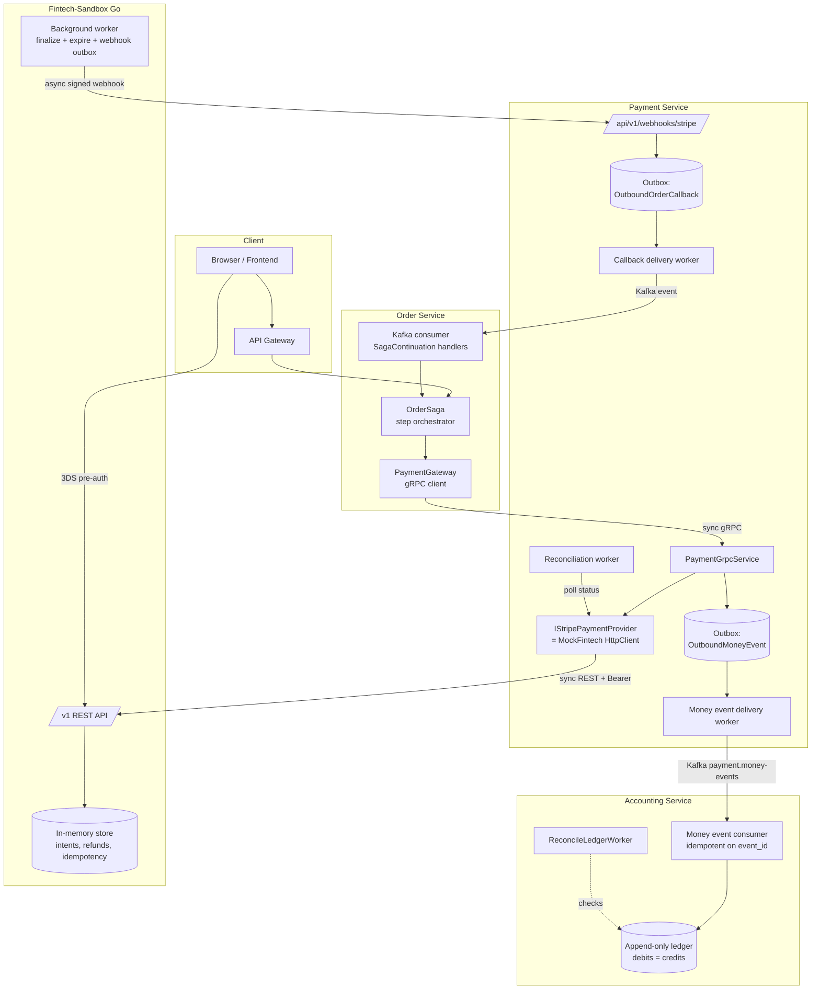
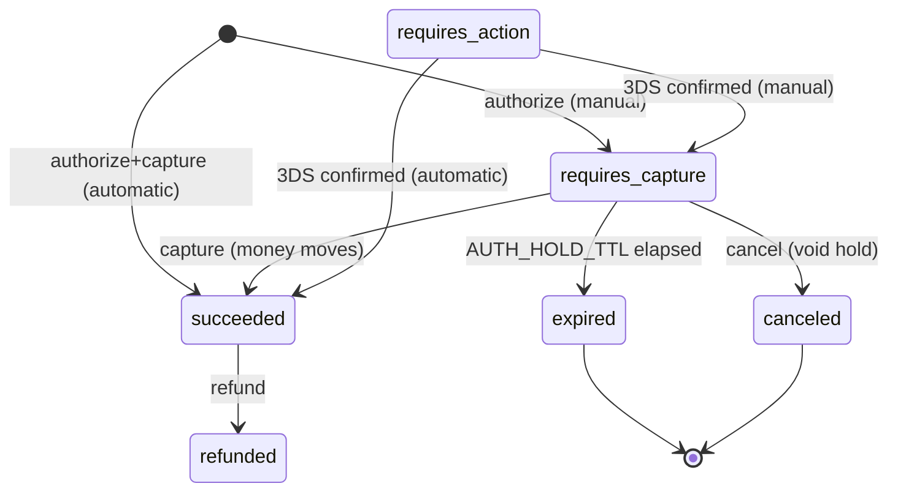
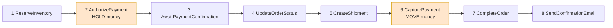
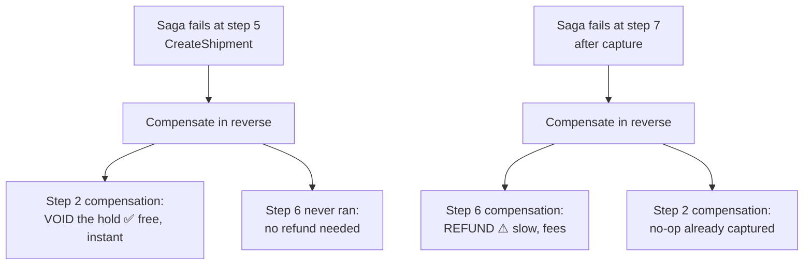
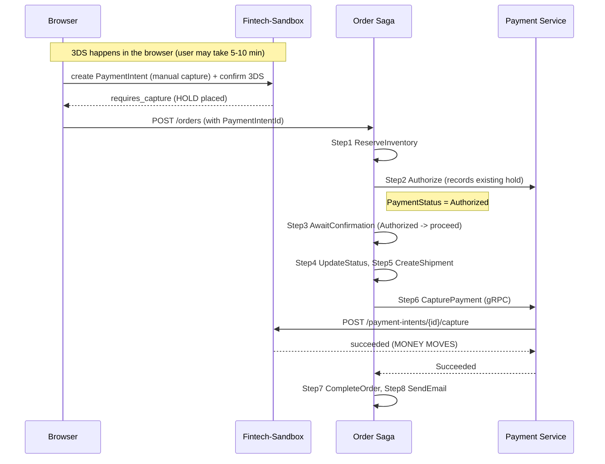
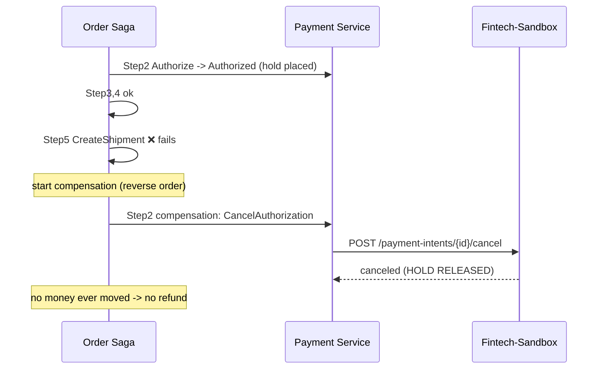
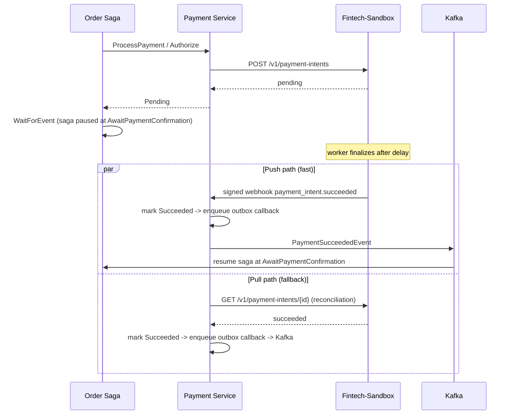
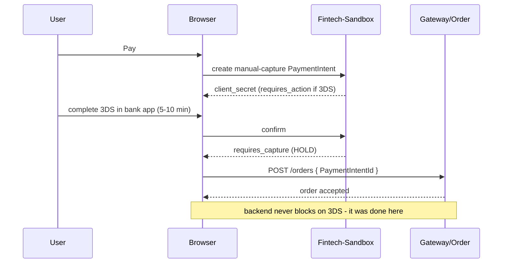

# Order ⇄ Payment ⇄ Fintech-Sandbox — How It All Works

This document explains how the three services cooperate to take money for an order:

- **Order service** — owns the order lifecycle and the **saga** that orchestrates everything.
- **Payment service** — the payment domain (idempotency, state machine, outbox, reconciliation). It is **provider-agnostic**.
- **Fintech-sandbox** — a standalone Go service that **imitates a Stripe-level card processor** for testing, without moving real money.

A fourth service sits downstream and is the **system of record for money that actually moved**:

- **Accounting service** — an append-only **double-entry ledger**. Payment writes a money-event in the same transaction as the money mutation; Accounting consumes that stream and posts balanced entries. Nothing in the money path blocks on it. See [Accounting/README.md](../Accounting/README.md).

The golden rule of the design: **authorize early (reserve funds), capture late (move money), void on failure (free), refund only what was captured.**

> **Where to look for the truth.** "Did this order get refunded?" is a ledger question, not a
> reconstruction across Payment rows, saga context and callbacks. Payment owns *state* (this intent
> is `Succeeded`); Accounting owns *money* (this much moved, on these accounts, at this time).

---

## 1. The actors and what they own

| Service | Tech | Role | Talks to |
|---|---|---|---|
| **Frontend / Gateway** | — | Runs 3DS in the browser, submits the order | Gateway → Order; Browser → Fintech-sandbox (3DS) |
| **Order service** | C#, event-sourced | Saga orchestration; decides when to authorize/capture/void/refund | gRPC → Payment; consumes Kafka from Payment |
| **Payment service** | C#, DDD + outbox | Payment aggregate, idempotency, state machine, webhooks, reconciliation | gRPC server; HTTP → provider; Kafka → Order |
| **Provider abstraction** | `IStripePaymentProvider` | One interface, 3 implementations | — |
| **Fintech-sandbox** | Go, in-memory | Stripe-shaped REST processor + signed webhooks | REST server; webhook → Payment |
| **Accounting service** | C#, append-only ledger | Double-entry money truth, reconciliation, FX reporting | consumes Kafka from Payment; gRPC server for Order + OpsConsole |

The Payment service picks its provider at startup via `Stripe:ProviderType`:

- `Stripe` → real Stripe SDK
- `MockFintech` → HTTP client to the **fintech-sandbox**
- `Fake` → in-memory simulation (unit/integration tests)

---

## 2. System architecture (components)

---

## 3. Communication styles — who is sync vs async

| Hop | Style | Mechanism | Why |
|---|---|---|---|
| Browser → Fintech-sandbox (3DS) | **async (user-paced)** | Client SDK; user may take 5–10 min | The bank-app approval lives entirely on the frontend |
| Gateway → Order (place order) | sync request | HTTP/gRPC | Order is created only after the hold exists |
| Order → Payment | **sync** | gRPC (`AuthorizeAsync`, `CaptureAsync`, `CancelAuthorizationAsync`, `RefundWithStatusAsync`) | Saga needs an immediate result to proceed |
| Payment → Fintech-sandbox | **sync** | REST + `Authorization: Bearer` | Provider call returns the intent/capture result |
| Fintech-sandbox → Payment | **async** | HMAC-signed webhook POST → `/api/v1/webhooks/stripe` | Finalizes pending/3DS outcomes |
| Payment → Order | **async** | Outbox → **Kafka** (`PaymentSucceeded/Failed`, `RefundSucceeded/Failed`) | Resumes a paused saga |
| Payment → Accounting | **async** | Second outbox → **Kafka** (`payment.money-events`) | Posts the ledger entry. Written in the same `SaveChangesAsync` as the mutation, so it cannot be lost |
| Payment ↔ Fintech-sandbox (fallback) | **sync poll** | Reconciliation worker calls `GET` status | Recovers if a webhook is lost |

**Key idea:** the request path (authorize/capture) is synchronous so the saga can make decisions; the *finalization* of anything pending is asynchronous (webhook) with a synchronous **reconciliation** poll as a safety net.

---

## 4. The money model — locking, capturing, unlocking

A card payment has **two distinct money movements**:

1. **Authorization (lock / hold)** — the bank reserves the funds. Money is *not* transferred. In the sandbox this is `capture_method: "manual"` → status `requires_capture`.
2. **Capture (move)** — the held funds actually move to the merchant. `POST /v1/payment-intents/{id}/capture` → `succeeded`.

Plus the two “undo” operations:

3. **Cancel / void (unlock)** — release an uncaptured hold. `POST /{id}/cancel` → `canceled`. Instant and **free**.
4. **Refund (reverse)** — return already-captured money. `POST /v1/refunds`. Slow, costs fees, customer sees charge+refund.

And one automatic safety:

5. **Hold expiry** — an uncaptured authorization auto-expires after `AUTH_HOLD_TTL` (default **8 days**, mirroring card networks). After expiry, capture is refused with `authorization_expired`.

The Payment service mirrors this with a domain `PaymentStatus` that now includes **`Authorized`** (the hold), and the Order saga mirrors it with **`OrderSagaPaymentStatus.Authorized`**.

---

## 5. The saga — which steps touch money

Steps run in `Order` order; compensation runs the **completed steps in reverse**.

- **Step 2 — AuthorizePayment** *(money: hold)*
  - **Frontend path:** the browser already created a manual-capture hold (3DS done client-side) and passed `PaymentIntentId`. The step just **records** it → `Authorized`. No backend call, instant.
  - **Backend path** (B2B/recurring): the step calls `AuthorizeAsync` → Payment `ProcessPayment(capture_method:"manual")` → hold. Invoice-like methods that settle immediately are treated as authorized.
  - **Compensation = VOID** the hold (`CancelAuthorization`). No money moved → free. No-op if already captured.

- **Step 3 — AwaitPaymentConfirmation**
  - If `Authorized` → proceed to fulfillment (capture happens later).
  - If `Pending`/`RequiresAction` (rare server-side 3DS) → `WaitForEvent` until a webhook resumes the saga.

- **Step 6 — CapturePayment** *(money: move)*
  - Captures the hold via `CaptureAsync` using `ProviderPaymentIntentId` (from context or `data.PaymentIntentId`).
  - **Compensation = REFUND** (only meaningful once captured).

**Why this ordering matters:**

Capturing **late** means most failures only need a free void, not a costly refund.

---

## 6. Happy path — place order to captured money

Note: in this frontend-pre-auth flow, **no backend webhook is needed** — the hold is already confirmed and capture is synchronous.

---

## 7. Failure path — void the hold (no refund)

If the failure happens **after** capture (step 7+), the compensation instead calls `RefundWithStatusAsync` → Payment `RefundPayment` → sandbox `/v1/refunds`.

---

## 8. Async backend payment + webhook + reconciliation (the dual path)

When a payment is **not** resolved synchronously (e.g. a backend-initiated `Pending`, or an automatic-capture charge awaiting provider confirmation), the saga pauses and is resumed asynchronously.

Two independent mechanisms converge on the same outcome:

- **Push (webhook):** sandbox POSTs a Stripe-shaped, **HMAC-signed** event to `/api/v1/webhooks/stripe`. Fast.
- **Pull (reconciliation):** Payment’s worker polls the sandbox `GET` status for stale pending records. Recovers lost webhooks.

The sandbox’s background worker also flips the stored status **regardless of webhook delivery**, so reconciliation always finds the truth even if every webhook delivery fails.

---

## 9. Webhook authenticity & idempotency

- **Signing:** the sandbox signs each webhook body as
  `Stripe-Signature: t=<unix>,v1=<hex(HMAC_SHA256(secret, "<t>.<body>"))>`,
  using a shared `WEBHOOK_SECRET`. Payment’s `StripeWebhookSignatureVerifier` validates it (fixed-time compare + timestamp tolerance).
- **Stripe-shaped envelope:** `{ id, type, data.object.{ id, status, metadata.payment_id, ... } }`, so Payment’s existing `StripeWebhookParser` consumes sandbox events unchanged.
- **Idempotency everywhere:**
  - Sandbox: `idempotency_key` per mutating call → identical cached response on replay.
  - Payment: unique `(OrderId, ProcessIdempotencyKey)` and webhook `ProviderEventId` dedup.
  - Order: saga step idempotency flags + status guards make resume/replay safe.

---

## 10. UI / frontend communication

- The **long, user-paced 3DS wait lives in the browser**, before the order is submitted.
- The backend receives an **already-confirmed hold**, so its authorize step is synchronous.
- A truly server-initiated 3DS (Option B) would move that wait to a backend webhook — deliberately **not** built, because B2B uses invoices/bank transfer (no 3DS).

---

## 11. End-to-end timeline (frontend pre-auth, the main case)

| Time | Where | What | Money |
|---|---|---|---|
| t=0 | Browser | user pays, 3DS challenge | — |
| t=0..10m | Browser | user approves in bank app | — |
| t≈10m | Browser→Sandbox | PaymentIntent → `requires_capture` | **HOLD** |
| t≈10m | Browser→Order | submit order with `PaymentIntentId` | — |
| +ms | Saga step 2 | record hold (`Authorized`) | hold confirmed |
| +s | Saga steps 3–5 | confirm, update, create shipment | — |
| +s | Saga step 6 | capture via Payment → sandbox | **MONEY MOVES** |
| +s | Saga steps 7–8 | complete order, send email | — |
| (on failure before 6) | compensation | void hold | unlock, free |
| (on failure after 6) | compensation | refund | reverse, fees |
| (no capture in 8 days) | sandbox | hold auto-expires | unlock |

---

## 12. Config that ties them together

| Setting | Service | Must match |
|---|---|---|
| `Stripe:ProviderType = MockFintech` | Payment | selects the sandbox provider |
| `MockFintech:BaseUrl` | Payment | sandbox address (e.g. `http://localhost:8090`) |
| `MockFintech:ApiKey` ↔ `API_KEY` | Payment ↔ Sandbox | bearer auth |
| `Stripe:WebhookSecret` ↔ `WEBHOOK_SECRET` | Payment ↔ Sandbox | webhook HMAC |
| `WEBHOOK_URL` | Sandbox | Payment webhook ingress |
| `AUTH_HOLD_TTL` (8 days) | Sandbox | authorization expiry |
| `capture_method: "manual"` | Payment→Sandbox | authorize-only vs authorize+capture |

---

## 13. The ledger — where money becomes a fact

Everything above is about *state transitions*. The ledger is about *money*, and it is a separate
concern with a separate owner.

Every money-moving handler in Payment (`ProcessPayment`, `CapturePayment`, `CancelAuthorization`,
`RefundPayment`, `HandleStripeWebhook`, `ReconcilePendingPayments`) writes a money-event into a
**second outbox** in the **same `SaveChangesAsync`** as the mutation itself. Either both land or
neither does, so a crash can never move money without recording it.

| Money event | Emitted when | Ledger posting |
|---|---|---|
| `PaymentAuthorizedEvent` | transition to `Authorized` | Dr `customer_authorized` / Cr `authorization_hold` |
| `PaymentVoidedEvent` | an **`Authorized`** payment transitions to `Failed` | Dr `authorization_hold` / Cr `customer_authorized` |
| `PaymentCapturedEvent` | transition to `Succeeded` | Dr `customer_captured` (+ `gateway_fees`) / Cr `merchant_revenue` (+ `tax_payable`) |
| `RefundIssuedEvent` | a `Refund` transitions to `Succeeded` | Dr `refunds_payable` / Cr `customer_captured` |

Three properties matter:

- **The saga never waits on the ledger.** It is downstream of Payment's outbox. If Accounting is
  down, events buffer in the topic and drain on recovery; Payment and the saga are unaffected.
- **The refund cash leg has exactly one owner: Payment.** The return saga's
  `UpdateAccountingRecordsStep` posts only the return-specific *revenue reversal*; Order's
  `IAccountingGateway` deliberately has no `RecordRefund` method at all. Two writers to one fact is
  how you get a double-booked refund.
- **Aggregate reconciliation catches what per-entity workers cannot.** Payment's and Order's
  reconciliation converge one stuck row at a time and never compare totals. Two refunds against one
  capture are *each individually balanced*, so `Σdebits = Σcredits` still holds and every entity-level
  check passes. Only comparing captured against refunded per order finds it — which is the class of
  bug behind the $4,180 double-refund post-mortem.

## 14. One-paragraph summary

The **browser** does 3DS and creates a **hold** on the **fintech-sandbox**, then submits the order. The **Order saga** records that hold (**AuthorizePayment**, step 2) synchronously over gRPC to the **Payment service**, proceeds through fulfillment, and **captures** the money late (**CapturePayment**, step 6) just before completing the order. If anything fails before capture, the saga **voids** the hold (instant, free); after capture it **refunds**. The Payment service is provider-agnostic: against the sandbox it speaks REST and trusts **signed webhooks** for any async finalization, with a **reconciliation poll** as a fallback, and it notifies the Order saga back over **Kafka**. Every movement is also written as a money-event in the same transaction and posted to the **Accounting** ledger, which is the source of truth for how much money actually moved. Uncaptured holds auto-expire after 8 days. Money is locked early, moved late, and unlocked cheaply on failure.
