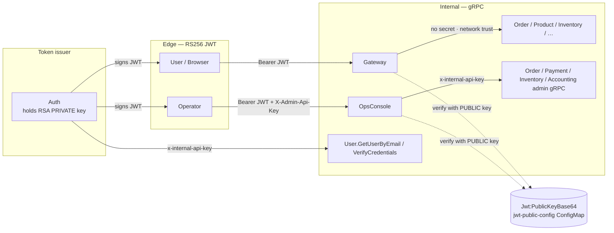

# Inter-Service & Edge Authentication

There are **two distinct trust boundaries**, with two different mechanisms. Don't conflate them:

| Boundary | Who | Mechanism |
|---|---|---|
| **Edge** | Human/client → Gateway, Operator → OpsConsole | **RS256 JWT** (asymmetric) |
| **Internal** | Service → service inside the cluster | **Network trust** + a shared API key only where the callee must trust the caller pre-JWT |



---

## Edge authentication — RS256 JWT (asymmetric)

Auth issues user/operator tokens signed with an **RSA private key** (RS256). The verifiers —
**Gateway** and **OpsConsole** — hold only the matching **public key**: they can validate tokens
but never mint them. Compromising a verifier can no longer forge a `SuperAdmin` identity.

| Role | Key it holds | Config key | Where it lives |
|---|---|---|---|
| Auth (signer) | RSA **private** | `Jwt:PrivateKeyBase64` | `auth-service-secret` (k8s Secret) |
| Gateway (verify) | RSA **public** | `Jwt:PublicKeyBase64` | `jwt-public-config` (k8s ConfigMap) |
| OpsConsole (verify) | RSA **public** | `Jwt:PublicKeyBase64` | `jwt-public-config` (k8s ConfigMap) |

- Keys are base64-encoded PEM; `RSA.ImportFromPem` auto-detects private vs public — the loader code is
  identical in all three services, only the key material differs.
- The public key is **not a secret**, but it is regenerated with the private half by
  `scripts/generate-k8s-secrets.sh`, so it ships in the gitignored `jwt-public-config` ConfigMap rather
  than in the committed `common-config` — a committed public key cannot then drift from the live signer.
- `Jwt:Issuer` (`AuthService`) and `Jwt:Audience` (`ApiGateway`) are validated on both verifiers; all
  three services **fail fast at startup** if their required Jwt config is missing outside Development.
- The deployed keypair is generated out-of-band and never committed — see [k8s/README.md](k8s/README.md).
  A separate throwaway keypair is committed for local runs only, in `appsettings.Development.json`
  (Auth holds the private half, Gateway/OpsConsole the public one); it is never used outside Development.

> **Why RS256, not HS256:** HS256 uses one symmetric key for both sign and verify, so every verifier
> would have to hold the signing key. A compromise of the most operator-exposed pod (OpsConsole) would
> then let an attacker *mint* tokens, not just check them. RS256 confines the private key to Auth.

---

## Internal authentication — service to service

Not all inter-service calls need a secret — only calls where the **callee must trust the caller's
identity** before a JWT exists. Most calls don't.

```
Auth → User.GetUserByEmail                    ✅ needs secret (called before any JWT exists)
Auth → User.VerifyCredentials                 ✅ same reason
OpsConsole → Order/Payment/Inventory admin    ✅ x-internal-api-key (privileged mutations)
OpsConsole → Accounting admin                 ✅ x-internal-api-key (ledger reads + adjusting entry)
Order → Accounting.ReverseRevenue             ✅ x-internal-api-key (posts to the money ledger)

Gateway → Order.StartB2BOrder                 ❌ no secret (Gateway already validated the user JWT)
Gateway → Product.CreateProduct               ❌ no secret
Order → Inventory.Reserve                      ❌ no secret
```

Gateway→service calls are safe without a secret because the Gateway **already validated the user's
JWT** before forwarding, and everything runs inside the private Kubernetes cluster network — an
outsider can't reach `order-service:8080` directly.

### The shared API key (`x-internal-api-key`)

Used on the privileged hops:

| Hop | Config key | Fail mode |
|---|---|---|
| OpsConsole → Order/Payment/Inventory admin gRPC | `InternalServices:OpsConsoleApiKey` | **fail-closed** (rejects if unset) |
| OpsConsole → Accounting `AdminAccountingService` | `InternalServices:OpsConsoleApiKey` | **fail-closed** |
| Order → Accounting `AccountingService` | `InternalServices:AccountingApiKey` | **fail-closed** |
| Auth → User (pre-JWT bootstrap) | internal API key on the User gateway | — |

**Accounting is the one service that checks two different keys.** Its `ApiKeyAuthInterceptor` picks
the expected key from the gRPC method name: `AdminAccountingService` accepts the OpsConsole key,
while the money-posting `AccountingService` requires the Accounting key. One shared key would mean an
operator console credential could call `ReverseRevenue` — so `accounting-service-secret` carries both.

- .NET maps `__` → `:`, so `InternalServices__OpsConsoleApiKey` → `configuration["InternalServices:OpsConsoleApiKey"]`.
- The OpsConsole key must match on **both** sides (`ops-console-service-secret` and each of
  `order-service-secret` / `payment-service-secret` / `inventory-service-secret`) or every admin RPC
  returns `PermissionDenied`.

---

## Summary

| Scenario | Auth mechanism |
|---|---|
| Human → Gateway | RS256 JWT Bearer (verify with public key) |
| Operator → OpsConsole | RS256 JWT Bearer + `X-Admin-Api-Key` |
| Gateway → internal service | Nothing (private-network trust) |
| OpsConsole → admin gRPC | `x-internal-api-key` (`InternalServices:OpsConsoleApiKey`) |
| Auth → User (pre-JWT) | `x-internal-api-key` |
| Service → service at scale (future) | mTLS / service mesh, or signed service tokens |

**Known future step:** the shared `x-internal-api-key` is still a *symmetric* secret copy-pasted across
services (same weakness class HS256 had — anyone who can verify can also forge). Replacing it with mTLS
or signed service tokens would apply the same "one private key at the issuer" model the edge JWT now
uses to the service-to-service boundary too.

### TODO — harden the inter-service communication itself

If what you actually want is to **harden the inter-service communication itself**, that's a separate
piece of work. The options, roughly in effort order:

1. **Signed service tokens** — reuse the RS256 setup you now have: each caller presents a short-lived
   Auth-signed JWT with `sub=order-service`, callee verifies with the public key. Closest to what's
   already built.
2. **mTLS** — each service gets a cert/keypair; the TLS handshake mutually authenticates. Usually done
   via a service mesh (Istio/Linkerd) so you don't hand-roll cert rotation.
3. **SPIFFE/SPIRE** — automated short-lived service identities; the "proper" version of #1 + #2.
