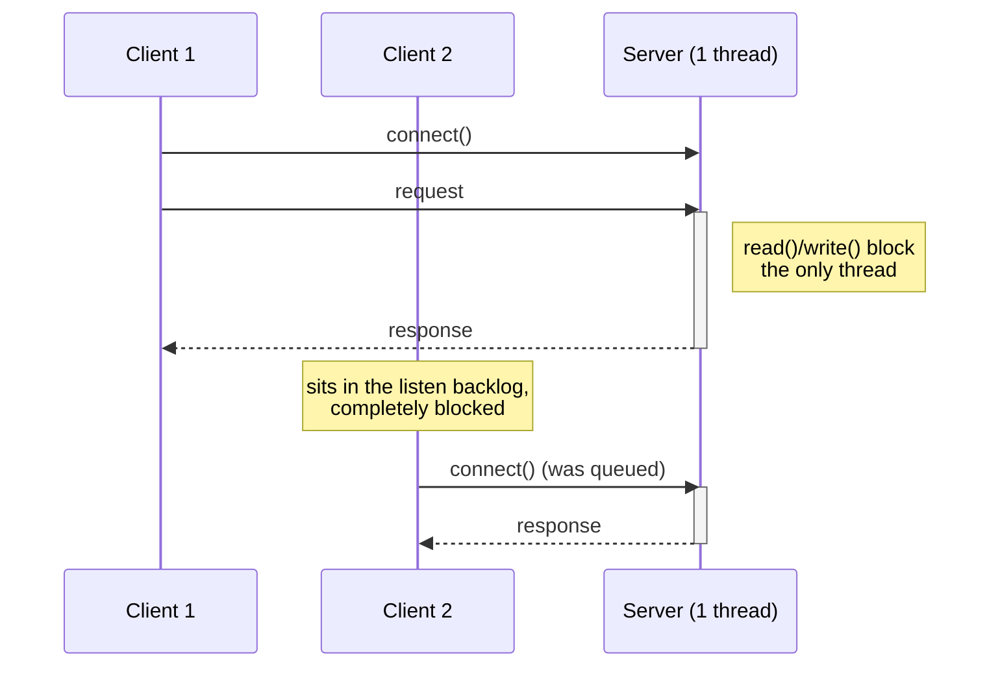
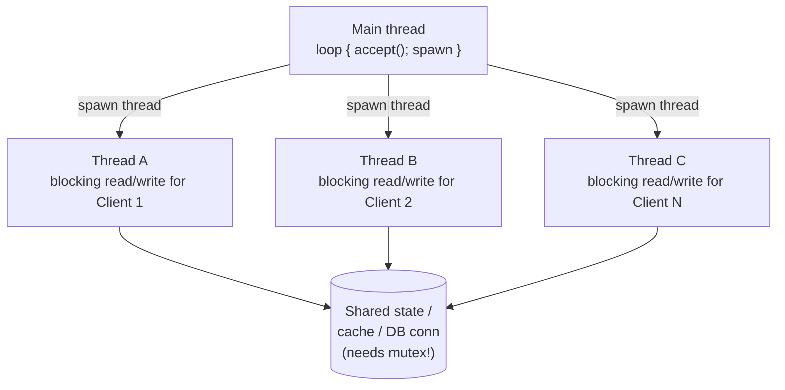
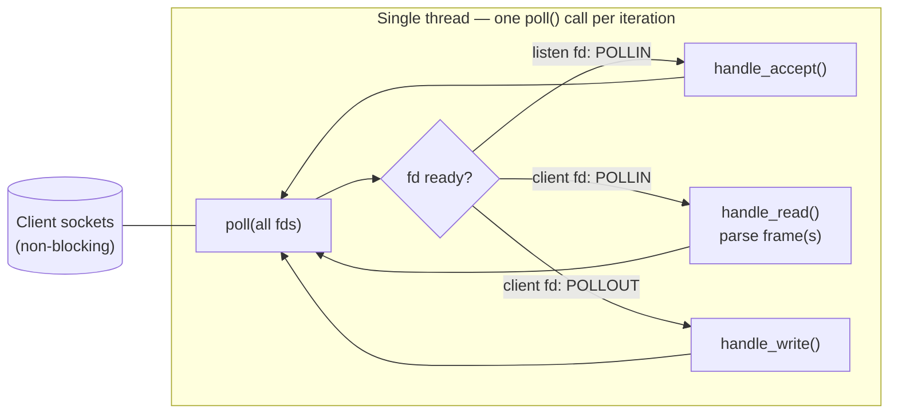
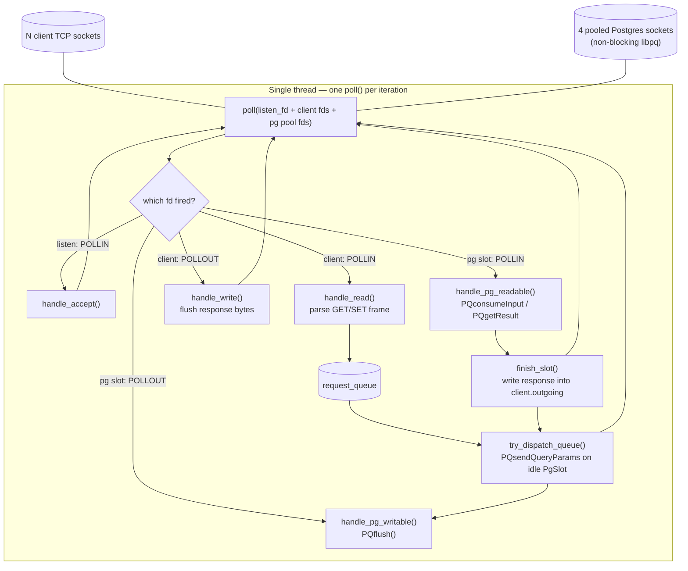
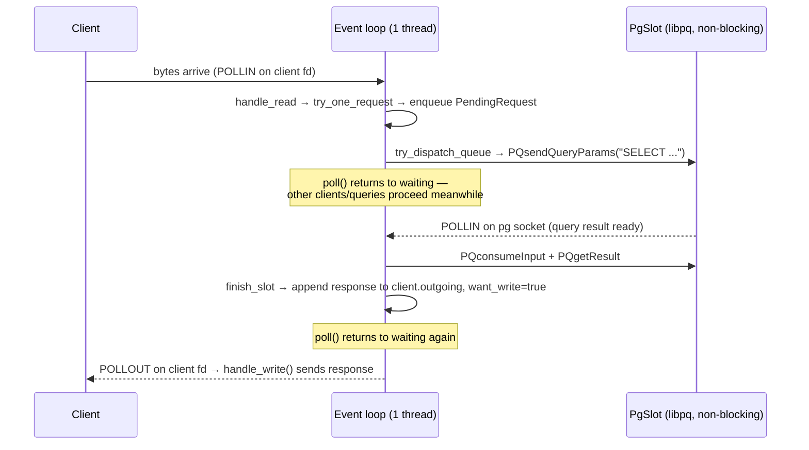

# Event Loop Conspect — `IdempotencyCache` demos

Short summary of the echo server/client (`src/`) and the async Postgres demo
(`async_demo/`), plus a comparison of the three server concurrency models.

## 1. Wire protocol

Both demos share the same framing:

```
[4 bytes: uint32 length, host byte order] [payload bytes...]
```

A message is only "complete" once its full length-prefixed body has arrived —
this is what lets a stream-oriented TCP socket carry discrete messages.

## 2. Client (`src/client.cpp`)

- `read_full(fd, buf, n)` / `write_all(fd, buf, n)` — generic primitives that
  loop over `read()`/`write()` because a single syscall can transfer **fewer
  bytes than requested** (short read/write). Protocol-agnostic.
- `read_res(fd)` — protocol-aware: uses `read_full` once for the 4-byte
  header, then again for exactly `len` body bytes. Built *on top of*
  `read_full`.
- **Pipelining**: `main()` sends all 5 requests first, then reads all 5
  responses, instead of request→wait→request→wait. This works because TCP
  buffers in both directions and the server drains/answers every complete
  frame it can find in one `read()`. Net effect: 1 round trip of latency
  instead of 5.
- The client itself is a plain **blocking, single-threaded** program — model
  #1 below.

## 3. Echo server (`src/server.cpp`)

- `fd_set_nb()` — `fcntl(F_GETFL/F_SETFL, O_NONBLOCK)` makes sockets
  non-blocking, so `read`/`write`/`accept` return immediately with `EAGAIN`
  instead of sleeping the thread.
- `Conn` — per-connection state (`incoming`/`outgoing` byte buffers +
  `want_read`/`want_write`/`want_close`). Needed because with non-blocking
  I/O a message may take several event-loop turns to fully arrive/send —
  there's no blocked call stack to "remember where we were", so the state
  must be explicit.
- `try_one_request()` — parses one framed message out of `incoming` if
  enough bytes are buffered; loops in `handle_read()` to drain multiple
  pipelined requests from a single `read()`.
- `poll()` — one syscall per loop iteration multiplexes readiness across the
  listening socket + every client socket, on a **single thread**.
- `fd2conn` — `std::vector<Conn*>` indexed directly by fd number for O(1)
  lookup.

## 4. Three server concurrency models

### Model A — Synchronous, single-threaded (blocking)


One thread, one connection served at a time. Simple, zero locking, but
concurrency = 1.

### Model B — Synchronous, multi-threaded (thread-per-connection / pool)


Real concurrency via OS threads/scheduler; each thread can block freely since
others keep progressing. Costs: thread creation + context-switch overhead,
and any shared state (cache, connection) needs locking.

### Model C — Asynchronous, single-threaded event loop (reactor) — **ours**


No threads, no locks — one thread multiplexes every connection via
`poll()`/`epoll()`. Every socket must be non-blocking; the app must keep
explicit per-connection state (`Conn`) since a message can span several
loop iterations. Scales to many connections cheaply, but a slow/blocking
callback stalls *everything*.

## 5. Our event loop, extended with a real async DB (`async_demo/async_pg_server.cpp`)

This demo adds a **second class of fd** to the same reactor: pooled
non-blocking `libpq` connections, driven through their own async API
(`PQsendQueryParams` / `PQflush` / `PQconsumeInput` / `PQisBusy` /
`PQgetResult`) instead of a blocking `PQexec`.



Sequence for one `GET key` request (spans multiple loop iterations):



Key details:
- **Connection pool** (`kPoolSize` libpq connections) — libpq's async API
  allows only one query in flight per connection, so the pool is what gives
  real concurrency for multiple simultaneous DB-backed requests.
- **`Conn::id`** guards against fd-reuse races: if a client disconnects
  before its query finishes, the OS may recycle its fd number for a new,
  unrelated client before the DB reply arrives; the id check discards stale
  responses instead of misdelivering them.
- **Parameterized queries** (`PQsendQueryParams` with `$1`/`$2`) — no SQL
  built by string concatenation, avoiding injection.
- Unlike the echo server's strict "either want_read or want_write" toggle,
  a `Conn` here can want **both** at once, since DB replies arrive
  asynchronously, independent of when new requests are read.

## 6. C++ / POSIX functions used, at a glance

| Area | Functions |
|---|---|
| Socket setup | `socket`, `setsockopt`, `bind`, `listen`, `accept`, `connect` |
| Non-blocking mode | `fcntl(F_GETFL/F_SETFL, O_NONBLOCK)` |
| Multiplexing | `poll` |
| I/O | `read`, `write`, `close` |
| Buffers | `std::vector::insert` (append), `std::vector::erase` (consume) |
| Async DB (libpq) | `PQconnectdb`, `PQsetnonblocking`, `PQsocket`, `PQsendQueryParams`, `PQflush`, `PQconsumeInput`, `PQisBusy`, `PQgetResult`, `PQresultStatus`, `PQgetvalue`, `PQclear`, `PQfinish`, `PQerrorMessage` |

## 7. Model comparison

| | A. Sync single-thread | B. Sync multi-thread | C. Async event loop (ours) |
|---|---|---|---|
| Threads | 1 | 1 per connection (or pool) | 1 |
| Blocking calls | Yes, freely | Yes, freely (each thread) | Never (all fds non-blocking) |
| Concurrency source | none | OS scheduler | `poll`/`epoll` readiness multiplexing |
| Shared-state locking | not needed | required (mutex) | not needed (single thread) |
| Per-connection state | implicit (call stack) | implicit (call stack per thread) | **explicit** (`Conn`, `PgSlot` structs) |
| Scaling limit | 1 concurrent client | thread count / context-switch cost | fd limits + must never block in a callback |
| Runtime support in C++ | none needed | `std::thread` | **none** — you hand-roll the reactor (unlike Node's libuv / C#'s IOCP+ThreadPool) |

## 8. Answering "do we maintain the event loop ourselves?"

Yes. C++ ships no async runtime. Node.js hides libuv (epoll/kqueue/IOCP +
a thread pool for disk/DNS) behind `async`/`await`; C# hides IOCP + the CLR
thread pool behind `Task`/`async`/`await`. In raw C++ with POSIX sockets,
`poll`/`epoll` only tells you *"these fds are ready"* — everything else
(per-connection state, deciding what "ready" means, dispatching callbacks,
re-arming interest for the next iteration) is code we write ourselves. The
`Conn`/`PgSlot` structs plus the `want_read`/`want_write`/`want_flush` flags
in this repo's demos **are** that hand-rolled reactor runtime.
